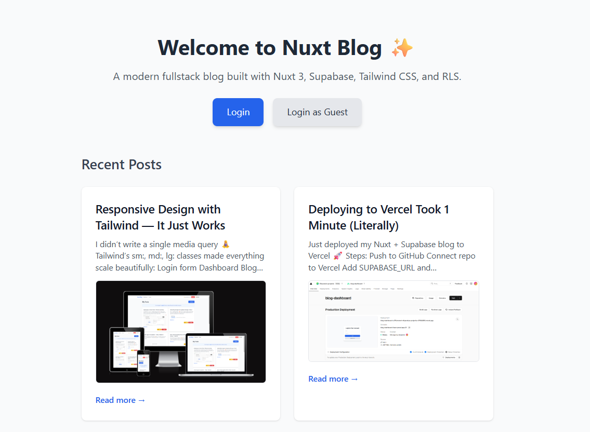
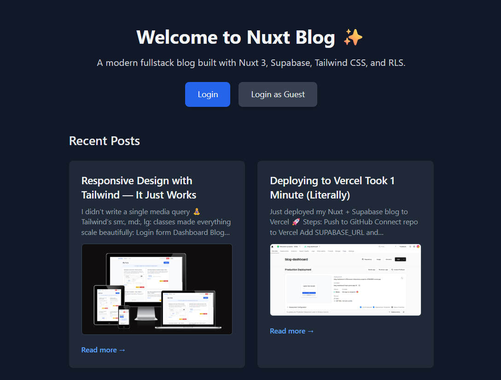
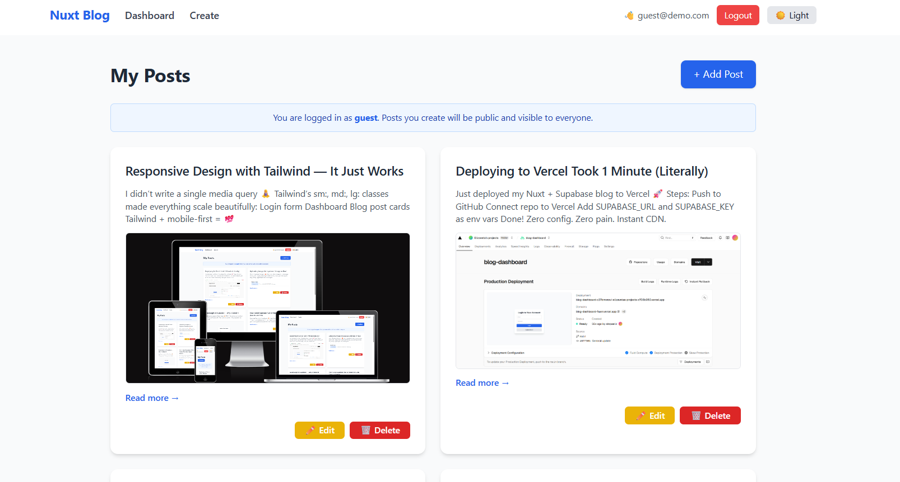
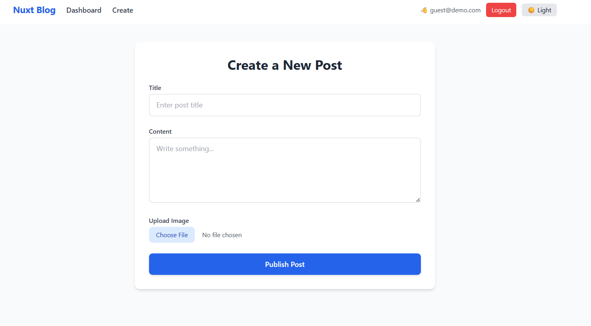
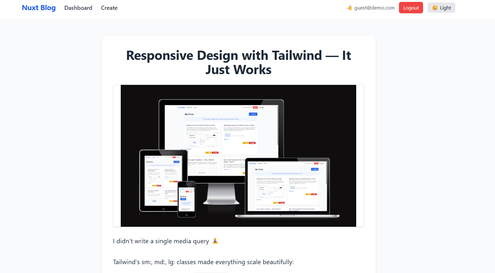

# Nuxt Blog Demo 🚀

> A modern full‑stack blog built with Nuxt 3, Supabase, Tailwind CSS, and RLS.  
> Demo live at: **https://blog-dashboard-fawn.vercel.app/**  
> Source code: https://github.com/stepaEliz/nuxt-blog-dashboard

---

## 🧩 About This Project

This full-stack blog platform was built as a showcase of my skills in Vue/Nuxt development, modern UI design, and secure backend architecture using Supabase.  
It includes full CRUD, RLS, authentication, image uploads, responsive design, and real production polish.

→ I built this project to demonstrate my readiness for full-time or freelance front-end / fullstack roles in Canada or remotely.

---

## 📸 Screenshots







---

## ⭐ Features

- ✅ Email/password authentication + “Login as Guest”  
- 🔐 Row‑level security (RLS): users see only their posts, guest sees all  
- 📝 CRUD: create, read, update, delete posts  
- 🖼 Image upload via Supabase Storage  
- 🎨 Light & Dark themes with toggle  
- 📱 Responsive design  
- 🌐 Public landing page with recent posts feed  
- 🔗 Shareable post URLs (`/posts/:id`)

---

## 🛠 Tech Stack

- **Nuxt 3** (Vue 3 + Vite)  
- **Supabase** (Auth, RLS, Storage, Database)  
- **Tailwind CSS** (+ `@tailwindcss/line-clamp`)  
- **nanoid** for unique filenames  
- **Vue Transition** for animations  
- **GitHub Actions** (optional, for CI/CD)

---

## 🚀 Getting Started

### 1. Clone the repo
```bash
git clone https://github.com/stepaEliz/nuxt-blog-dashboard.git
cd nuxt-blog-dashboard
```

### 2. Install dependencies
```bash
npm install
```

### 3. Configure environment variables
Create a file .env in project root:

#### .env
```bash
NUXT_PUBLIC_SUPABASE_URL=https://<your-project>.supabase.co
NUXT_PUBLIC_SUPABASE_KEY=<anon-or-public-key>
```

### 4. Run locally
```bash
npm run dev
```
Open http://localhost:3000 in your browser.

---

## 🔒 RLS Policies

We have two types of users:

1. **Guest user** (`guest@demo.com`):  
   - Can **create**, **read**, **update**, **delete** **any** post  
     (great for quick demo and testing without signup)

2. **Registered users**:  
   - Can **read all** posts (public feed)  
   - Can **create** new posts  
   - Can **update** or **delete** **only their own** posts (Dashboard)

Apply these policies in Supabase SQL Editor:

```sql
-- 1) Guest full CRUD
ALTER POLICY "Guest full access"
  ON public.posts
  TO public
  USING (auth.uid() = '2308948d-568c-439b-9222-87a9540a65df'::uuid)
  WITH CHECK (auth.uid() = '2308948d-568c-439b-9222-87a9540a65df'::uuid);

-- 2) Users own-post CRUD
ALTER POLICY "Users own-post access"
  ON public.posts
  TO public
  USING (auth.uid() = user_id)
  WITH CHECK (auth.uid() = user_id);

-- 3) Public read for everyone
ALTER POLICY "Allow read"
  ON public.posts
  TO public
  USING (true);

```
---

## 🎛 Usage

1. Login with your email/password

2. Login as Guest (guest@demo.com / 12345678)

3. Dashboard shows your posts (guest sees all)

4. Create a post with title, content, and optional image

5. Edit/Delete only what you own (guest can edit/delete any post)

6. Dark Mode toggle in header

---

## 💬 Contributing
Feel free to open issues or pull requests.
For major changes, please open an issue first to discuss.

---

## 📄 License
[MIT](https://choosealicense.com/licenses/mit/) © Elizaveta Stepanishina

